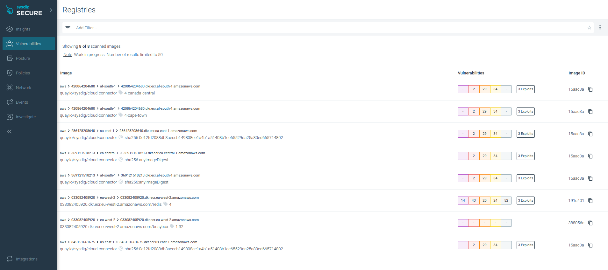

# OrganizationSetup - Registry Scanner (push event-based)

## Use-Case explanation

This use case is aimed to internally test the new Sysdig [Vulnerability Management Engine Scanner](https://docs.sysdig.
com/en/docs/sysdig-secure/vulnerabilities/), which is currently under CA (controlled-availability), which will 
replace current [Container Registry Scanner](https://docs.sysdig.com/en/docs/sysdig-secure/scanning/integrate-with-container-registries/)
[See release notes](https://docs.sysdig.
com/en/docs/release-notes/saas-sysdig-secure-release-notes/#april-20-2022)

:warning: No support is given yet. If you're interested in participating in the testing phase, please contact us :)

### Scope

- By default, Secure for cloud covers several [features](https://github.com/sysdiglabs/terraform-aws-secure-for-cloud#sysdig-secure-for-cloud-in-aws), including threat-detection and compliance. First 
  cannot be disabled (for the  moment). Use `deploy_benchmark=false` if Unified Compliance is not desired.
  

## Usage

ECR event-based scanner has been enabled through the input parameter `deploy_beta_image_scanning_ecr=true` (not 
enabled by default) in the following examples

- organizational (ecs)
- single-account-ecs
- single-account-eks
- single-account-apprunner

Once deployed, [confirm cloud-account it's correctly enrolled](https://docs.sysdig.
com/en/docs/installation/sysdig-secure-for-cloud/deploy-sysdig-secure-for-cloud-on-aws/#confirm-the-services-are
-working) for the selected features.

Push some images to the scoped registry (depending on the selected single-account or organizational setup), and 
check the results appear Secure Platform.

:warning: Currently, no menu option is available, but can access it through `/#/vulnerabilities/registry` path.



## Full setup example

Based on the desired example, the only requirement to enable the vulnerability management engine, is to use the 
input `deploy_beta_image_scanning_ecr=true`.

### Single Account

For a quick testing setup, we suggest using the less resource-demanding AWS AppRunner compute flavour of Secure for 
Cloud.

```terraform
terraform {
   required_providers {
      sysdig = {
         source  = "sysdiglabs/sysdig"
         version = ">=0.5.33"
      }
   }
}

provider "sysdig" {
   sysdig_secure_api_token = "<SYSDIG_SECURE_URL>"
   sysdig_secure_url       = "<SYSDIG_SECURE_API_TOKEN"
}

provider "aws" {
   region = "<AWS_REGION> Take care of AppRunner available zones: https://docs.aws.amazon.com/general/latest/gr/apprunner.html"
}

module "cloudvision_aws_apprunner_single_account" {
   source = "sysdiglabs/secure-for-cloud/aws//examples/single-account-apprunner"
   deploy_beta_image_scanning_ecr = true
}
```
### Organizational

For the organizational setup, based on ECS compute service, use following manifest.

```terraform
terraform {
  required_providers {
    sysdig = {
      source = "sysdiglabs/sysdig"
    }
  }
}

provider "sysdig" {
  sysdig_secure_url       = "<SYSDIG_URL>"
  sysdig_secure_api_token = "<SYSDIG_SECURE_API_TOKEN>"
}

provider "aws" {
  region = "<REGION>"
}

provider "aws" {
  alias = "member"
  region = "<REGION>"
  assume_role {
    # ORG_MEMBER_SFC_ACCOUNT_ID is the organizational account where sysdig secure for cloud compute component is to be deployed
    # 'OrganizationAccountAccessRole' is the default role created by AWS for managed-account users to be able to admin member accounts.
    # <br/>https://docs.aws.amazon.com/organizations/latest/userguide/orgs_manage_accounts_access.html
    role_arn = "arn:aws:iam::${ORG_MEMBER_SFC_ACCOUNT_ID}:role/OrganizationAccountAccessRole"
  }
}

module "secure-for-cloud_example_organizational" {
  providers = {
    aws.member = aws.member
  }
  source                    = "github.com/sysdiglabs/terraform-aws-cloudvision//examples/organizational?ref=new-beta-scanning-ecr"
  
  deploy_beta_image_scanning_ecr = true
  sysdig_secure_for_cloud_member_account_id = "<ORG_MEMBER_SFC_ACCOUNT_ID>"
}

```
